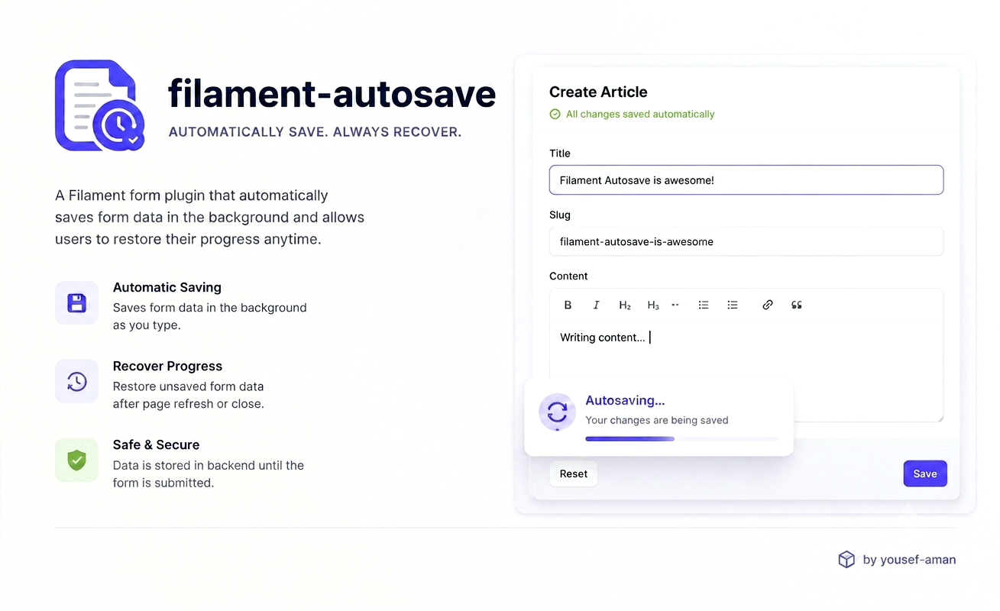

# Filament Autosave

[](https://packagist.org/packages/yousefaman/filament-autosave)
[](https://packagist.org/packages/yousefaman/filament-autosave)
[](https://github.com/yousef-aman/filament-autosave/actions/workflows/tests.yml)
[](LICENSE.md)

Automatic form saving for Filament v4 and v5 with a visual status indicator and one-step Undo on Edit pages.

- **Edit pages** — changes are written to the database after a debounce.
- **Create and custom pages** — unsubmitted changes are stored as a draft in Laravel Cache. When the user returns, they can *Restore* or *Discard* the draft.

<p class="filament-hidden">
  
</p>

## Requirements

- PHP 8.2+
- Filament v4 or v5
- Livewire v3 (with Filament v4) or v4 (with Filament v5)

Laravel is not constrained by this package; it comes from Filament, which accepts
11.28+, 12 and 13. CI covers Laravel 12 and 13 only — Composer 2.9+ refuses to
install any Laravel 11 release, because the whole 11.x line is past its
security-support window.

### Tested combinations

| PHP | Filament | Laravel |
| --- | --- | --- |
| 8.2, 8.3, 8.4 | v4, v5 | 12 |
| 8.4 | v4, v5 | 13 |
| 8.2 | v4.0 (lowest dependencies) | 12 |

## Installation

```bash
composer require yousefaman/filament-autosave
```

Register the plugin in your panel provider:

```php
use YousefAman\FilamentAutosave\AutosavePlugin;

public function panel(Panel $panel): Panel
{
    return $panel->plugin(AutosavePlugin::make());
}
```

The status indicator ships its own CSS/JS assets. If you copy Filament's assets
into `public/` for production, re-run:

```bash
php artisan filament:assets
```

Publish the config (optional):

```bash
php artisan vendor:publish --tag="filament-autosave-config"
```

Publish the translations (optional):

```bash
php artisan vendor:publish --tag="filament-autosave-translations"
```

Publish the indicator view to customize its markup (optional):

```bash
php artisan vendor:publish --tag="filament-autosave-views"
```

## Usage

### Edit pages

```php
use Filament\Resources\Pages\EditRecord;
use YousefAman\FilamentAutosave\HasAutosave;

class EditArticle extends EditRecord
{
    use HasAutosave;

    protected static string $resource = ArticleResource::class;
}
```

The form autosaves 1.5 s after the last keystroke. After each save, an **Undo** button appears briefly to revert that write.

Autosave persists the form's **dehydrated** state — the same values Filament would
write on a normal save (`dehydrateStateUsing()` transforms and casts applied,
`dehydrated(false)` fields skipped) — but without running validation, so an
incomplete form never blocks the save. What that means per field type:

| Field | Autosaved? |
| --- | --- |
| Plain column-backed field | ✓ |
| Plain (non-relationship) `Repeater`, `CheckboxList` — stores to its own column | ✓ |
| Single `Select::relationship()` (`BelongsTo`) — Filament dehydrates the foreign key | ✓ |
| Multiple `Select`, `BelongsToMany`, `Repeater::relationship()`, and anything else Filament persists through `saveRelationships()` | ✗ — on explicit submit only |
| `->dehydrated(false)` | ✗ |

Because validation is skipped, field-level rules (`minLength`, `maxValue`, etc.)
are **not** enforced during autosave — only on explicit submit. Two things are
always enforced, because skipping them would let autosave persist what a normal
save rejects:

- A `required` field left blank is skipped rather than written, so it never
  violates a `NOT NULL` column.
- A `Select`, `CheckboxList` or `ToggleButtons` value outside the field's own
  options (including options scoped to the current tenant or team) is skipped.

You can enforce further rules non-blockingly via `getAutosaveValidationRules()`
(see below).

### Fields nested under a state path

A field inside a `Group`/`Section` with a `statePath()`, or inside a `Repeater`,
lives under a nested key (`settings.api_key`, `items.*.secret`). That whole
top-level key is written as one column value, so autosave writes it **only when
every field beneath it survived** the rules above. If one nested field is skipped
— a password, an out-of-options `Select`, a blank `required` — the entire container
is left untouched rather than written back without it, which would destroy the
stored value of the skipped field.

Practically: a `statePath()`ed group or a `Repeater` that contains a
`->password()` field is never autosaved. The rest of the form still is.

Create-page drafts are re-filled into the form instead of written to a column, so
there is nothing to destroy — a nested secret is pruned from the draft and its
siblings are kept.

### Create pages

```php
use Filament\Resources\Pages\CreateRecord;
use YousefAman\FilamentAutosave\HasAutosaveForCreate;

class CreateArticle extends CreateRecord
{
    use HasAutosaveForCreate;

    protected static string $resource = ArticleResource::class;
}
```

### Custom Filament pages

For pages without an Eloquent record. The form must use the default `data`
state path (`->statePath('data')`), which is what the status indicator watches:

```php
use Filament\Pages\Page;
use YousefAman\FilamentAutosave\HasAutosaveForCreate;

class UserPreferences extends Page
{
    use HasAutosaveForCreate;

    public ?array $data = [];

    public function save(): void
    {
        $data = $this->form->getState();
        // ... persist however you like

        $this->clearAutosaveDraft();
    }
}
```

Call `$this->clearAutosaveDraft()` from your save handler to drop the draft once the user submits.

## Configuration

Each option supports the levels listed below, merged so the **later** wins
(`config → plugin → page`), except `except`, which is unioned across all levels.

| Option | config | plugin | page |
| --- | :---: | :---: | :---: |
| `debounce` | ✓ | ✓ | ✓ |
| `except` | ✓ | ✓ | ✓ |
| `cache_ttl` | ✓ | ✓ | — |
| `show_timestamp` | ✓ | ✓ | — |
| `indicatorPosition` | — | ✓ | — |
| `exceptPages` | — | ✓ | — |

> Page-level options are **methods**. Do not redeclare a property the trait
> already defines (`$autosaveEnabled`, `$autosaveSnapshotHash`,
> `$autosaveDebounceMs`, `$autosaveCanUndo`, `$autosaveHasDraft`): PHP treats a
> redeclaration with a different default as an incompatible trait composition and
> raises a fatal error.

### Debounce

```php
AutosavePlugin::make()->debounce(2000);       // plugin-wide

// per-page
protected function autosaveDebounce(): ?int
{
    return 2000;
}

// config/filament-autosave.php
'debounce' => 1500,
```

### Exclude fields

```php
AutosavePlugin::make()->except(['internal_notes']);

// per-page — unioned with the plugin and config lists
protected function autosaveExcept(): array
{
    return ['internal_notes'];
}

// config/filament-autosave.php
'except' => ['password', 'password_confirmation'],
```

### Exclude specific pages

Suppress the indicator on individual pages that use one of the traits (an
alternative to `shouldAutosave()` on the page itself):

```php
AutosavePlugin::make()
    ->exceptPages([EditPayment::class]);
```

### Draft TTL (Create pages)

```php
AutosavePlugin::make()->cacheTtl(48);         // hours
'cache_ttl' => 24,
```

### Indicator

```php
AutosavePlugin::make()
    ->showTimestamp(false)
    ->indicatorPosition('after');
```

`indicatorPosition` places the indicator before or after the page header actions.
A page that overrides `getHeader()`, or that has no heading, header actions and
breadcrumbs at all, renders no header — there the indicator falls back to the end
of the page rather than disappearing along with autosave.

### Per-page disable

```php
class EditSensitive extends EditRecord
{
    use HasAutosave;

    protected function shouldAutosave(): bool
    {
        return false;
    }
}
```

`shouldAutosave()` is authoritative on the server, so a disabled page cannot be
switched back on from the browser.

## Lifecycle hooks

`beforeAutosave()` and `getAutosaveValidationRules()` apply to both Edit and
Create/custom pages. `afterAutosave()` runs on **Edit pages only** — it receives
the saved record, which Create pages don't have until submit.

```php
protected function beforeAutosave(array $data): array
{
    return $data;
}

protected function afterAutosave(object $record): void
{
    Cache::forget("user-{$record->id}");
}

/** @return array<string, mixed> */
protected function getAutosaveValidationRules(): array
{
    return [
        'slug' => ['required', 'string', 'max:120'],
    ];
}
```

Every rule whose field is part of the payload is checked; a field that fails is
silently skipped so autosave never blocks the user. Full form validation still runs
at submit time.

Rule keys may target nested paths (`'items.*.qty' => ['integer', 'min:1']`). A
failure there skips the whole top-level key (`items`) for the same reason nested
containers are all-or-nothing — see [above](#fields-nested-under-a-state-path).

Autosave runs `mutateFormDataBeforeSave()` and writes inside a database
transaction, matching Filament's `save()`. It deliberately does **not** fire
Filament's `beforeSave`/`afterSave` hooks or the `RecordUpdated`/`RecordSaved`
events — use `afterAutosave()` for work that should run on every autosave. It
re-baselines Filament's unsaved-changes tracking whenever the write covered every
filled field, so a panel using `->unsavedChangesAlerts()` won't warn about changes
autosave already wrote.

## Undo (Edit pages)

After a successful autosave, the indicator shows an **Undo** button for 5 seconds. Clicking it:

1. Reads the pre-save values from a short-lived cache entry (30 min by default, override via `protected function getUndoTtlMinutes(): int`).
2. Writes them back through `handleRecordUpdate()`.
3. Re-fills the form.
4. Clears the undo snapshot.

Undo only replays a snapshot created by the *same live page instance*, so a
snapshot left behind by an earlier page load can't roll back an edit made since.
The snapshot covers real columns only — an accessor/mutator-backed field is not
undoable.

## Files and sensitive data

Dropped from every autosave payload automatically:

- `TemporaryUploadedFile` instances (pending file uploads).
- Any `TextInput` marked `->password()` **or** `->type('password')`, at any depth.
  On an Edit page autosave would otherwise commit a half-typed secret; on a Create
  page it would sit in the draft cache in plain text.
- The `except` list (config + plugin + page), applied to both the autosave write
  and the draft restore.
- Client-submitted keys that don't map to a declared form field — at every depth,
  so a crafted payload cannot smuggle extra keys into a JSON column either.

`except` matches **top-level** field names only; to drop a field nested inside a
`Repeater` row or a `statePath()`ed group, mark it `->password()` or
`->dehydrated(false)`.

Because a skipped field is genuinely unsaved, an autosave that had to skip a field
the user actually filled in does **not** re-baseline Filament's unsaved-changes
tracking — so `->unsavedChangesAlerts()` still warns before navigation instead of
reporting the typed secret as saved.

`->dehydrated(false)` keeps a field out of **Edit-page writes**, but *not* out of
Create-page drafts — those are built from raw form state precisely so the user
gets back exactly what they typed. For a secret on a Create page, use `except` (or
`->password()`, which is handled for you).

## Translations

Publish translations with `--tag="filament-autosave-translations"` to customize any of the indicator labels (`unsaved`, `saving`, `saved`, `saved_at`, `undo`, `undone`, `error`, `draft_available`, `restore`, `discard`, `restored`).

## Testing

```bash
composer test                          # everything
vendor/bin/pest --testsuite=Unit       # traits and manager, no panel
vendor/bin/pest --testsuite=Integration  # real EditRecord/CreateRecord in a booted panel
```

## License

MIT
